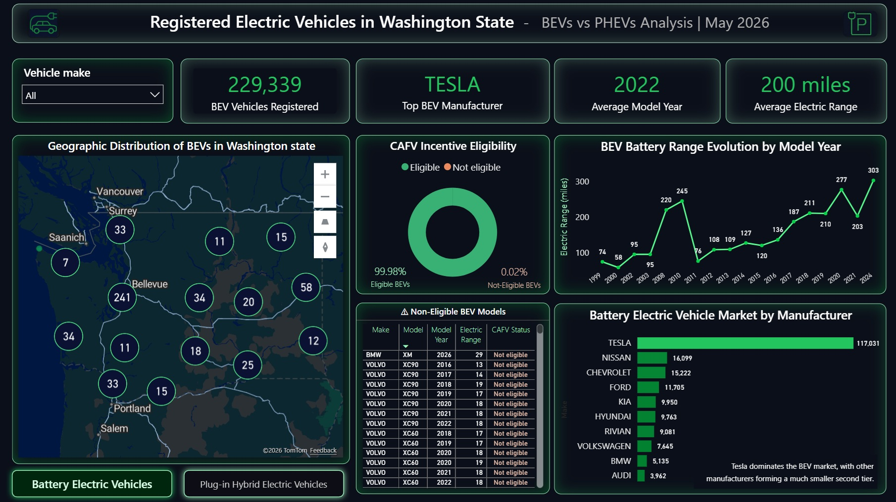
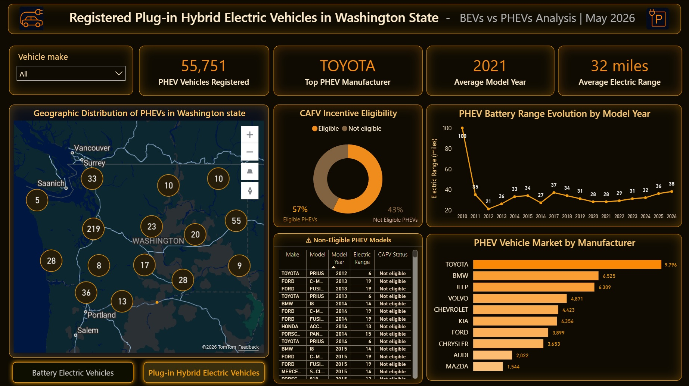

I built an interactive Power BI dashboard analyzing Battery Electric Vehicles (BEVs) and Plug-in Hybrid Electric Vehicles (PHEVs) registered in Washington State using publicly available government data.
The report combines geographic analysis, CAFV incentive eligibility, battery range trends, manufacturer market share, and interactive tooltip drilldowns to create a dynamic EV market overview.
## Key Features:

I created multiple custom measures for both BEV and PHEV analysis, including:
- Total registered vehicles
- Average electric range
- Average model year
- Top manufacturers
- Most popular models
- CAFV eligibility %
- Tooltip-specific dynamic measures
- Conditional “No data available” logic
- Dynamic display formatting (e.g., 200 miles, N/A, percentages).
## Examples of implemented logic:
1. Filtering BEV vs PHEV datasets separately.
2. Ignoring blank/zero electric range values.
3. Handling unavailable CAFV eligibility data.
4. Dynamic tooltip context filtering.
## Interactive Tooltip Pages:
I designed custom tooltip report pages that appear on mouse hover, including:
- ✅ Geographic tooltip cards;
- ✅ Manufacturer insights by region;
- ✅ Vehicle registration evolution by model year;
- ✅ Dynamic average range metrics;
- ✅ Context-aware CAFV statistics.
This creates a much more interactive and exploratory user experience compared to standard Power BI visuals.

## Automated Daily Data Refresh
The report uses a live public government dataset connected directly from:
https://catalog.data.gov/dataset/electric-vehicle-population-data.
Since the source is connected through a web data link, the dataset can be refreshed automatically whenever new vehicle registration data becomes available. This allows the dashboard to stay current without manual file replacement.

## Skills Practiced:
- Power BI
- DAX
- Data Modeling
- Interactive Tooltips
- Conditional Formatting
- Geospatial Visualization
- Time-Series Analysis
- Dynamic Measures
- UI/UX Dashboard Design
- Web Data Integration
- Automated Refresh Logic.

### Watch the full report via the link:

[https://app.powerbi.com/view?r=eyJrIjoiMzQ4ZjA4MGMtMmFjMC00MmMwLWE3NzItZTZkMDM0ZTc4Njc2IiwidCI6IjY1NWVhZjVhLTBhMTctNDEzOS05NzU5LTFlMDIzMTRkMDJhYiIsImMiOjZ9](https://app.powerbi.com/view?r=eyJrIjoiMTA5ZGY0MmQtOWM0Yy00NGI3LTliMGItNmJjODkzZWIzZTQ5IiwidCI6IjY1NWVhZjVhLTBhMTctNDEzOS05NzU5LTFlMDIzMTRkMDJhYiIsImMiOjZ9)

## Key dashboards

### Battery Electric Vehicles

### Plug-in Hybrid Electric Vehicles

